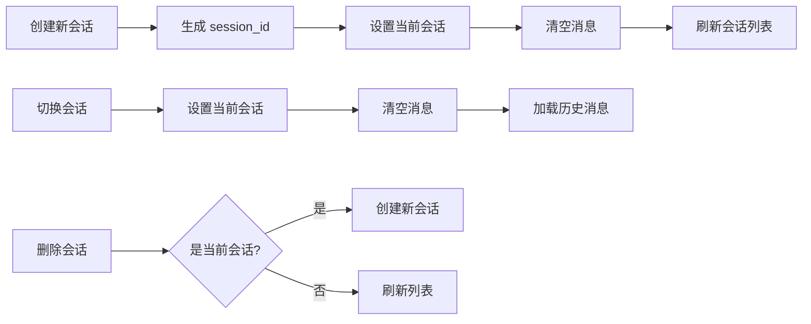

# Agent-V3 优化总结

## 📅 更新日期
2025-01-29

## ✅ 已完成的优化

### 1. 会话管理功能 ✨

#### 后端API增强
- **GET `/api/chat/sessions`** - 列出所有会话
  ```json
  {
    "success": true,
    "count": 3,
    "sessions": [
      {
        "session_id": "session-123",
        "message_count": 15,
        "last_message": "你好，请介绍一下你自己",
        "is_active": true
      }
    ]
  }
  ```

- **DELETE `/api/chat/sessions/{session_id}`** - 删除指定会话
- **DELETE `/api/chat/sessions`** - 清空所有会话

#### 前端功能集成
- ✅ 在原有 Sidebar 中集成完整会话管理
- ✅ 支持创建新会话
- ✅ 显示会话列表（消息数、最后一条消息）
- ✅ 切换会话
- ✅ 删除会话（带确认对话框）
- ✅ 刷新会话列表
- ✅ 会话状态指示（active）
- ✅ 删除当前会话时自动创建新会话

### 2. UI/UX 优化 🎨

#### 输入框优化
- **调整高度**: `min-h-[60px]` → `min-h-[44px]`
- **最大高度**: `max-h-[200px]` → `max-h-[120px]`
- **初始行数**: 添加 `rows={1}`
- **效果**: 输入框更紧凑，与消息气泡视觉一致

#### 滚动优化
```typescript
useEffect(() => {
  const timer = setTimeout(() => {
    if (scrollRef.current) {
      const scrollElement = scrollRef.current.querySelector('[data-radix-scroll-area-viewport]')
      if (scrollElement) {
        scrollElement.scrollTop = scrollElement.scrollHeight
      }
    }
  }, 100)
  return () => clearTimeout(timer)
}, [messages])
```
- ✅ 新消息自动滚动到底部
- ✅ 使用 setTimeout 确保 DOM 更新后再滚动
- ✅ 正确定位 Radix UI ScrollArea 的 viewport 元素

#### 布局优化
- ✅ 移除重复的 `SessionsSidebar` 组件
- ✅ 保持单一 `Sidebar` 组件，功能更集中
- ✅ 侧边栏可折叠，节省空间

### 3. 知识库功能界面 📚

#### 功能特性
- ✅ 创建知识库（名称 + 描述）
- ✅ 搜索过滤（名称、描述、标签）
- ✅ 显示文档数量
- ✅ 标签系统
- ✅ 上传文档到知识库
- ✅ 删除知识库

#### 组件位置
`frontend/components/knowledge-browser.tsx`

#### 使用模拟数据
当后端API未实现时，使用默认模拟数据：
- Product Documentation (24 docs)
- Customer Support (156 docs)
- Research Papers (42 docs)

### 4. 工具配置管理界面 🛠️

#### 功能特性
- ✅ 显示所有工具及其状态
- ✅ 工具类型标识（builtin, api, mcp）
- ✅ 启用/禁用开关
- ✅ 工具描述和说明
- ✅ 统计信息（总数、启用数、禁用数）
- ✅ 刷新工具列表

#### 组件位置
`frontend/components/tools-settings.tsx`

#### 显示信息
- 工具显示名称
- 工具类型（Badge）
- 工具描述
- 工具内部名称（monospace）
- 启用状态开关

### 5. 前端API客户端增强 🔌

#### 新增API方法

**会话管理**:
```typescript
api.chat.listSessions()
api.chat.deleteSession(sessionId)
api.chat.clearAllSessions()
```

**文件管理**:
```typescript
api.files.uploadFile(file, options)
api.files.listFiles(options)
api.files.deleteFile(fileId)
api.files.getDownloadUrl(fileId)
```

**工具管理**:
```typescript
api.tools.listTools()
```

**健康检查**:
```typescript
api.health.check()
```

### 6. Store 状态管理增强 📦

#### 新增方法
```typescript
interface AppState {
  // ... 现有状态
  clearMessages: () => void  // 清空消息列表
}
```

## 🔧 技术实现细节

### 会话管理流程



### 组件架构

```
App (page.tsx)
├── Sidebar (会话管理 + 导航)
│   ├── 会话列表
│   │   ├── 新建会话按钮
│   │   ├── 刷新按钮
│   │   └── 会话项 (hover 显示删除按钮)
│   └── Quick Access
│       ├── Knowledge Bases
│       └── CrewAI Teams
├── ChatInterface (聊天界面)
│   ├── 消息列表 (ScrollArea)
│   └── 输入区域
│       ├── 文件上传按钮
│       ├── 输入框 (Textarea)
│       └── 发送按钮
└── ToolPanel (工具面板)
    ├── 知识库浏览器
    ├── CrewAI 可视化
    └── 工具设置
```

## 📊 当前功能状态

| 功能 | 状态 | 说明 |
|------|------|------|
| 会话管理 | ✅ 完成 | 创建、列出、切换、删除 |
| UI优化 | ✅ 完成 | 输入框、滚动、布局 |
| 知识库界面 | ✅ 完成 | 使用模拟数据，待后端API |
| 工具配置 | ✅ 完成 | 可查看和切换工具状态 |
| CrewAI界面 | ⏳ 待完善 | 已有基础组件 |
| 系统设置 | ⏳ 待完善 | 需要实现设置页面 |

## 🚀 测试指南

### 1. 测试会话管理

```bash
# 启动服务
cd /Users/xiaochenwu/Desktop/Agent-V3
./start_all.sh

# 访问前端
open http://localhost:3000
```

**测试步骤**:
1. 点击 "New Chat" 创建新会话
2. 发送几条消息
3. 再次创建新会话
4. 在侧边栏切换会话
5. Hover 到会话项，点击删除按钮
6. 点击刷新按钮更新列表

### 2. 测试API

```bash
# 列出会话
curl http://localhost:8000/api/chat/sessions

# 删除会话
curl -X DELETE http://localhost:8000/api/chat/sessions/{session_id}

# 列出工具
curl http://localhost:8000/api/tools/list
```

### 3. 测试UI优化

1. **输入框**: 输入多行文本，观察高度变化
2. **滚动**: 发送多条消息，检查是否自动滚动到底部
3. **布局**: 折叠/展开侧边栏，检查响应式布局

## 🐛 已修复的问题

### 1. 聊天接口响应格式错误
**问题**: `agent.run()` 返回字典，前端期望字符串
**修复**: 
```python
if isinstance(response, dict):
    response_text = response.get('response', str(response))
else:
    response_text = str(response)
```

### 2. 重复的侧边栏
**问题**: 同时存在 `Sidebar` 和 `SessionsSidebar`
**修复**: 删除 `SessionsSidebar`，功能合并到 `Sidebar`

### 3. 滚动不工作
**问题**: Radix UI ScrollArea 需要特殊处理
**修复**: 使用 `querySelector` 定位 viewport 元素

## 📝 待完成功能

### 1. CrewAI 配置和运行界面
- [ ] CrewAI 配置编辑器
- [ ] Agent 配置可视化
- [ ] Task 流程可视化
- [ ] 运行时参数输入
- [ ] 执行状态显示
- [ ] 结果展示

### 2. 系统设置
- [ ] LLM 提供商配置
- [ ] 模型选择
- [ ] 温度、Top-P 等参数
- [ ] API Key 管理
- [ ] 日志级别设置
- [ ] 主题切换

### 3. 知识库后端API
- [ ] 创建知识库 API
- [ ] 上传文档 API
- [ ] 文档解析和向量化
- [ ] 语义搜索 API
- [ ] 知识库删除 API

## 🎯 下一步计划

1. **完善CrewAI界面** (优先级: 高)
   - 实现配置编辑器
   - 添加运行控制面板
   - 集成到工具面板

2. **实现系统设置** (优先级: 中)
   - 创建设置页面
   - 实现配置持久化
   - 添加设置验证

3. **知识库后端** (优先级: 高)
   - 实现完整的知识库API
   - 集成向量数据库
   - 支持多种文档格式

## 📦 相关文件

### 后端
- `api_server.py` - FastAPI 应用，会话管理API
- `src/infrastructure/tools/` - 工具注册和管理
- `config/tools/unified_tools.yaml` - 工具配置

### 前端
- `frontend/components/sidebar.tsx` - 主侧边栏（含会话管理）
- `frontend/components/chat-interface.tsx` - 聊天界面
- `frontend/components/knowledge-browser.tsx` - 知识库浏览器
- `frontend/components/tools-settings.tsx` - 工具配置管理
- `frontend/lib/api.ts` - API 客户端
- `frontend/lib/store.ts` - Zustand 状态管理

## 🔗 相关文档
- [V3.1 升级总结](./V3.1_UPGRADE_SUMMARY.md)
- [功能升级计划](./docs/FEATURE_UPGRADE_PLAN.md)
- [前端集成文档](./FRONTEND_INTEGRATION.md)
- [README](./README.md)

---

**最后更新**: 2025-01-29
**版本**: V3.1
**状态**: 基础功能完成，高级功能开发中

