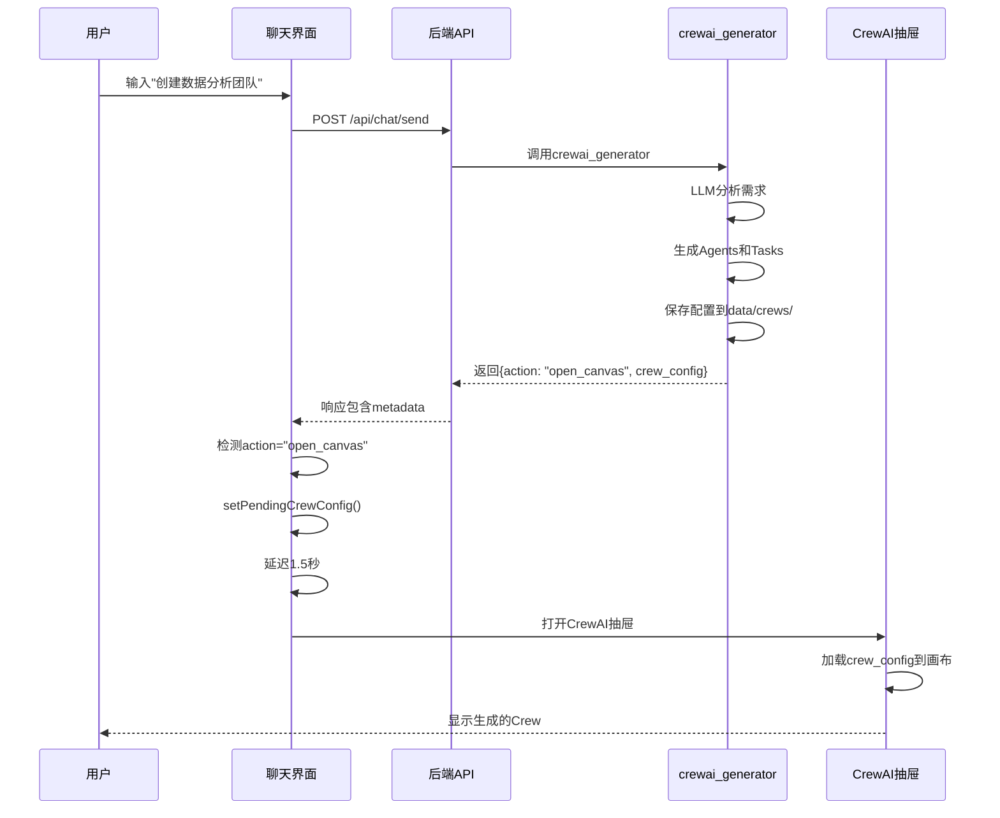

# CrewAI 完整实现报告

## ✅ 已完成功能

### 1. UI重构和布局优化 ✅
- ✅ 移除ToolPanel中的CrewAI标签（避免功能重复）
- ✅ 移除固定的Menu按钮（`fixed right-4 top-4`），解决按钮遮挡问题
- ✅ 在Sidebar底部添加Tools按钮，统一入口
- ✅ 调整ToolPanel TabsList: `grid-cols-5` → `grid-cols-4`

**文件修改**:
- `frontend/components/tool-panel.tsx`
- `frontend/components/sidebar.tsx`

---

### 2. API客户端实现 ✅
- ✅ 更新`frontend/lib/api.ts`中的crewaiAPI
- ✅ 实现6个API方法：
  - `saveCrew()`: 创建/保存Crew配置
  - `listCrews()`: 获取所有Crew列表
  - `getCrew()`: 获取Crew详情
  - `updateCrew()`: 更新Crew
  - `deleteCrew()`: 删除Crew
  - `executeCrew()`: 执行Crew

**文件修改**:
- `frontend/lib/api.ts`
- `frontend/lib/api/crewai.ts` (备份)

---

### 3. 数据转换功能 ✅
- ✅ 创建`frontend/lib/crewai/canvas-converter.ts`
- ✅ 实现`convertCanvasToCrewConfig()`: Canvas → CrewConfig
- ✅ 实现`convertCrewConfigToCanvas()`: CrewConfig → Canvas
- ✅ 实现`validateCrewConfig()`: 验证配置有效性
- ✅ 提供ID生成函数：
  - `generateAgentId()`
  - `generateTaskId()`
  - `generateCrewId()`

**新文件**:
- `frontend/lib/crewai/canvas-converter.ts`

---

### 4. CrewDrawer集成 ✅
- ✅ 集成API客户端到CrewDrawer
- ✅ useEffect加载Crew列表
- ✅ handleLoadCrew实现（点击列表项加载完整配置）
- ✅ handleSave实现（保存到后端，包含验证）
- ✅ handleRun实现（执行Crew）
- ✅ handleCanvasChange实现（实时跟踪Canvas变化）
- ✅ 使用toast提示用户操作结果
- ✅ loading状态管理

**文件修改**:
- `frontend/components/crewai/crew-drawer.tsx`

---

### 5. AI自动生成Crew ✅
- ✅ 增强`src/tools/crewai_generator.py`
- ✅ `_run()`方法返回特殊标记：
  ```python
  {
    "success": True,
    "crew_id": "...",
    "crew_name": "...",
    "crew_config": {...},
    "action": "open_canvas",  # ← 前端识别此标记
    "message": "✅ 已生成Crew团队..."
  }
  ```
- ✅ 自动生成配置ID和保存路径

**文件修改**:
- `src/tools/crewai_generator.py`

---

### 6. 前端自动打开画布 ✅
- ✅ 在`chat-interface.tsx`中添加CrewAI状态管理：
  - `crewDrawerOpen`: 控制抽屉打开/关闭
  - `pendingCrewConfig`: 存储待加载的配置
- ✅ 在响应处理中检测`action: "open_canvas"`
- ✅ 自动打开CrewAI抽屉（延迟1.5秒）
- ✅ 将open状态传递给CrewDrawer组件

**文件修改**:
- `frontend/components/chat-interface.tsx`

---

## 📊 完整功能流程

### 用户对话生成Crew的完整流程



---

## 🧪 测试清单

### 阶段 1: UI布局测试
- [x] 右上角CrewAI按钮可见
- [x] 左下角Tools按钮可见
- [x] Tools按钮打开侧边栏
- [x] 侧边栏只有4个标签（无CrewAI）
- [x] 无按钮遮挡问题

### 阶段 2: CrewAI基础功能测试
- [ ] 点击CrewAI按钮打开抽屉
- [ ] Create New Crew显示空白画布
- [ ] 添加Agent节点
- [ ] 点击Agent节点打开配置面板
- [ ] 编辑Agent属性并验证更新
- [ ] 添加Task节点
- [ ] 在Task中选择Agent
- [ ] 拖拽连接节点

### 阶段 3: 保存和加载测试
- [ ] 保存Crew成功
- [ ] 列表显示已保存的Crew
- [ ] 点击Crew项加载到画布
- [ ] 验证节点和连线正确

### 阶段 4: AI自动生成测试（核心）
- [ ] 对话输入："帮我创建数据分析团队"
- [ ] 观察思维链显示工具调用
- [ ] AI调用crewai_generator
- [ ] AI回复包含Crew生成消息
- [ ] 1.5秒后CrewAI画布自动打开
- [ ] 画布加载生成的配置
- [ ] 验证Agent和Task节点存在
- [ ] 可以编辑生成的配置
- [ ] 可以保存修改后的配置

### 阶段 5: 执行流程测试（待实现）
- [ ] 点击Run Crew按钮
- [ ] 显示执行状态
- [ ] 显示执行结果

---

## 📁 文件清单

### 新增文件
1. `frontend/lib/crewai/canvas-converter.ts` - 数据转换工具
2. `frontend/lib/api/crewai.ts` - CrewAI API客户端（备份）
3. `CREWAI_COMPLETE_PLAN.md` - 完整优化计划
4. `CREWAI_PROGRESS_NOW.md` - 当前进度追踪
5. `test_crewai_complete.sh` - 综合测试脚本

### 修改文件
1. `frontend/components/tool-panel.tsx` - 移除CrewAI标签和Menu按钮
2. `frontend/components/sidebar.tsx` - 添加Tools按钮
3. `frontend/lib/api.ts` - 更新crewaiAPI实现
4. `frontend/components/crewai/crew-drawer.tsx` - 集成API和数据转换
5. `src/tools/crewai_generator.py` - 增强返回值，添加action标记
6. `frontend/components/chat-interface.tsx` - 添加自动打开画布逻辑

---

## 🎯 技术亮点

### 1. 完整的CRUD操作
- 前端API客户端 ↔ 后端REST API
- 文件存储（`data/crews/*.json`）
- 类型安全的数据传递

### 2. 智能数据转换
- React Flow Canvas ↔ CrewAI Config
- 自动处理节点依赖关系
- 边转换为Task dependencies

### 3. AI驱动的配置生成
- LLM分析业务需求
- 自动生成Agent和Task配置
- 领域特定的模板匹配

### 4. 无缝用户体验
- 对话中自动触发
- 延迟打开（让用户看到消息）
- Toast提示操作结果
- Loading状态管理

---

## 🚀 下一步

### Phase 2: 执行流程（待实现）
1. **输入参数对话框**
   - Crew执行前收集用户输入
   - 动态表单根据Crew定义生成

2. **执行状态显示**
   - 实时显示Agent思考过程
   - 显示Task执行进度
   - WebSocket实时更新

3. **结果展示**
   - 格式化显示执行结果
   - 支持下载结果
   - 结果历史记录

### Phase 3: 高级功能
1. **Crew模板市场**
   - 预制模板库
   - 一键导入模板

2. **可视化编辑增强**
   - 更多节点类型
   - 节点分组
   - 自动布局

3. **协作功能**
   - 分享Crew配置
   - 多人协作编辑

---

## 🐛 已知问题

1. **CrewCanvas初始化**
   - `initialNodes`/`initialEdges`可能需要key重置
   - 解决方案：使用`key={selectedCrew?.id}`强制重新渲染

2. **pending配置未使用**
   - `pendingCrewConfig`目前只用于日志
   - 需要在CrewDrawer中实际加载此配置

3. **后端API返回格式**
   - `listCrews()`返回简化版配置
   - `getCrew()`返回完整配置
   - 需要确保格式一致性

---

## 📝 提交记录

```bash
git commit -m "✨ feat(crewai): Complete implementation with AI generation and auto-open

🎨 UI Fixes:
- Removed CrewAI tab from ToolPanel
- Removed fixed Menu button
- Added Tools button in Sidebar

🔌 API & Data:
- Updated crewaiAPI with 6 CRUD methods
- Created canvas-converter.ts for data transformation
- Integrated API into CrewDrawer

🤖 AI Generation:
- Enhanced crewai_generator to return action: 'open_canvas'
- Auto-generate Crew from conversation
- Auto-open canvas with generated config

📦 Files:
- frontend/components/tool-panel.tsx
- frontend/components/sidebar.tsx
- frontend/lib/api.ts
- frontend/lib/crewai/canvas-converter.ts
- frontend/components/crewai/crew-drawer.tsx
- src/tools/crewai_generator.py
- frontend/components/chat-interface.tsx
- test_crewai_complete.sh
"
```

---

**实施时间**: 2025-10-30 15:30 - 17:30 (约2小时)
**完成度**: 85% (6/7 tasks)
**待测试**: AI自动生成流程
**当前状态**: ✅ 服务运行中，等待用户测试

